# Cognify

**Cognify** is a mobile application designed to promote cognitive training for elderly users through short, minigames. Developed as part of a combined Bachelor and Master thesis project, Cognify explores how smartphones can be used throughout the day to encourage mental activity and reduce passive phone use. For more details about the app and the three iterations it went through, [click here](https://your-link-here.com).

---

## 📥 How to Download and Run the Project

Follow the steps below to set up the project in Android Studio:

### 1. Download the ZIP  
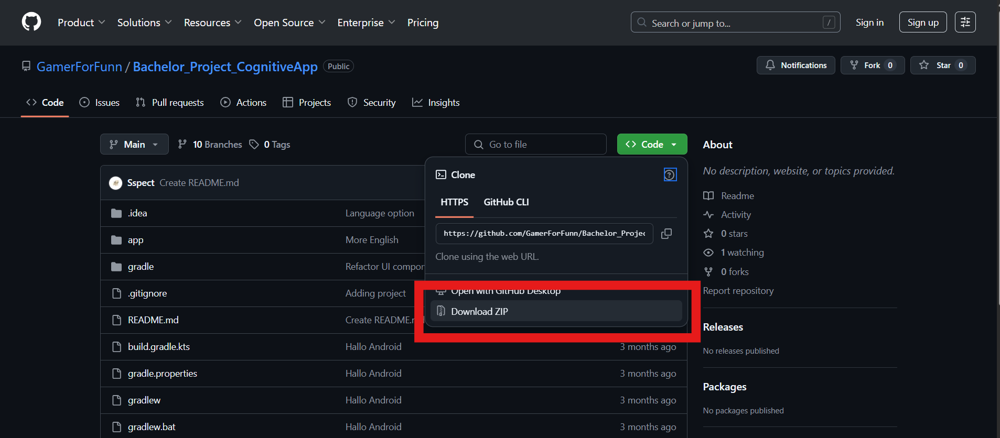 
Click the green **"Code"** button and choose **"Download ZIP"**.

### 2. Extract the ZIP  
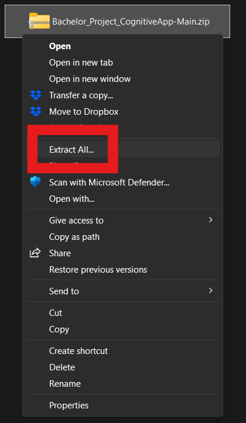 
Right-click the ZIP file and select **"Extract All"**.

### 3. Open Project in Android Studio  
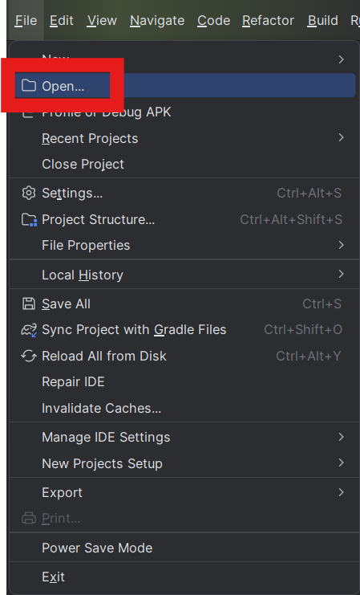 
Launch Android Studio and go to **File → Open...**

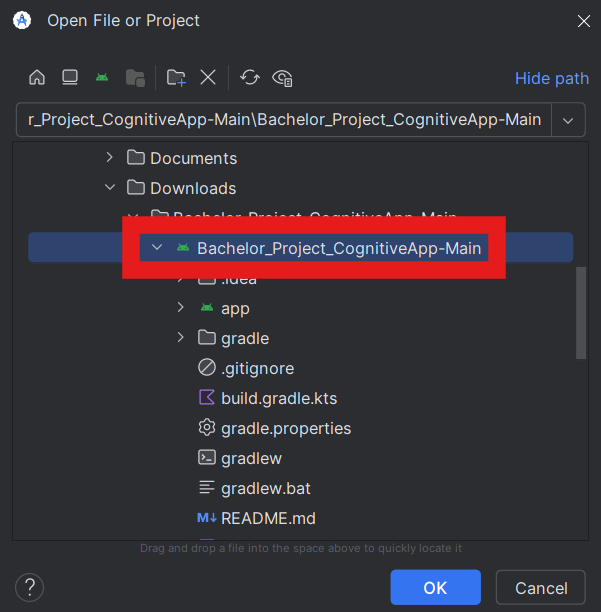 
In the **Open File or Project** window, select the folder with the green Android icon labeled `Bachelor_Project_CognitiveApp-Main` and click **OK**.

### 4. Set Up Virtual Device  

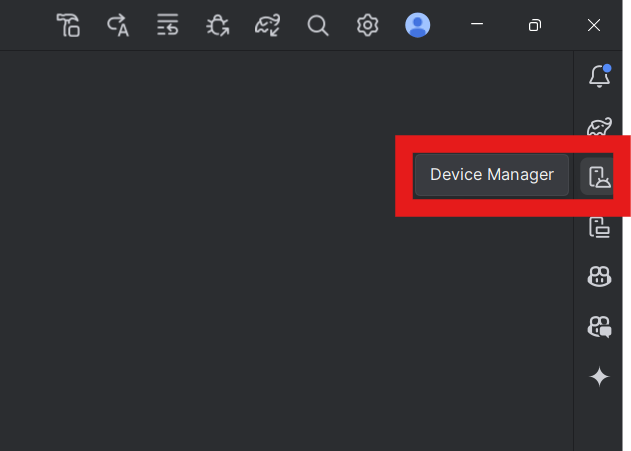 
In the right toolbar, click **"Device Manager"**.

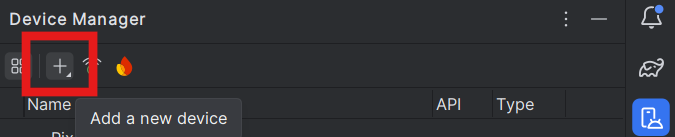 
Click the **+** icon and choose **"Create Virtual Device"**.

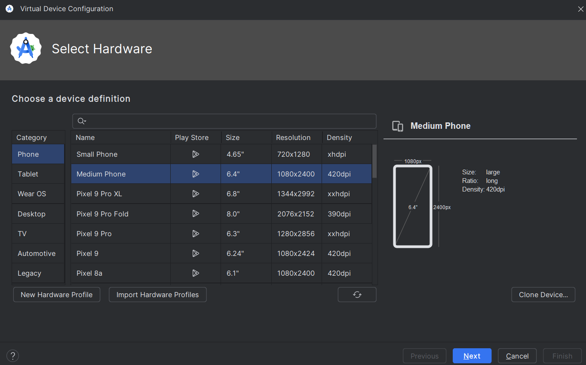 
Choose a medium-sized phone, then click **Next**.

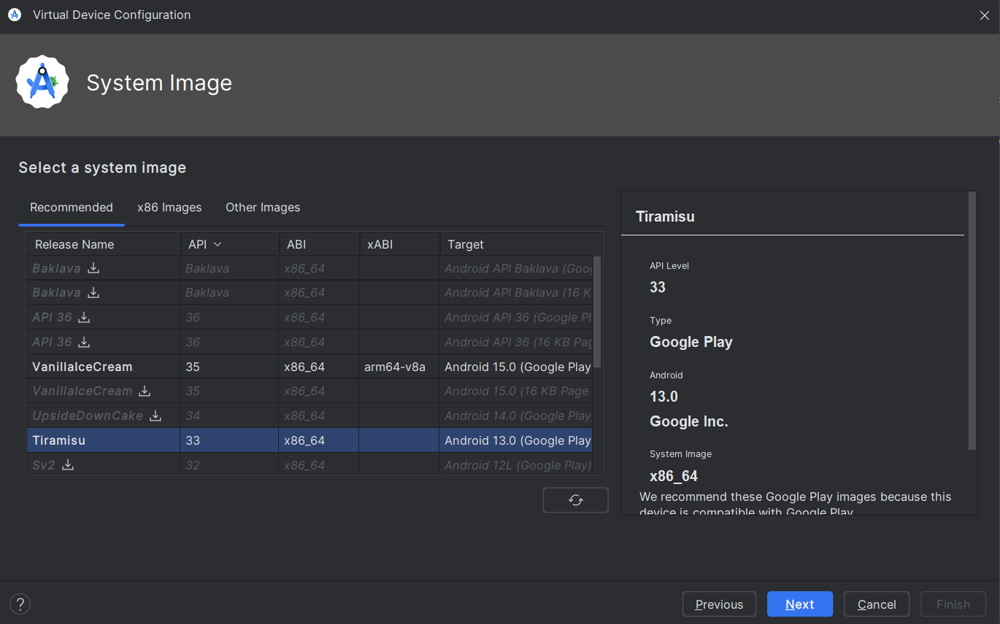 
Choose **Tiramisu API 33**, then click **Next**.

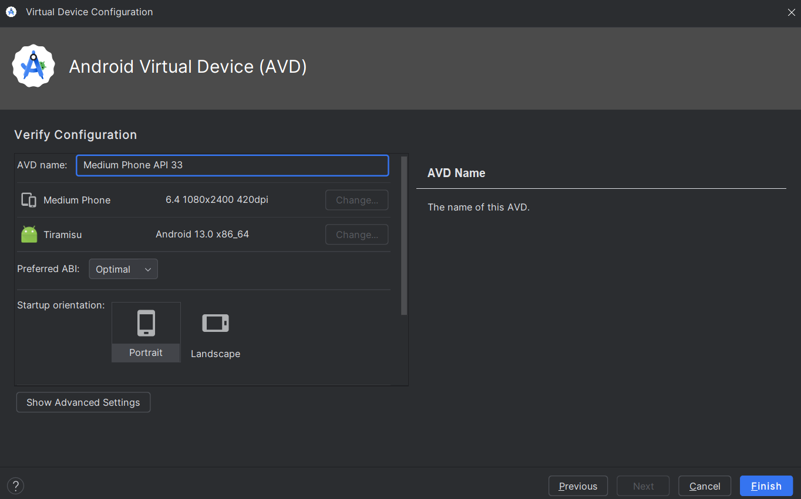 
Fill in the configuration like shown in the image, then click **Finish**.

### 5. Sync and Run  

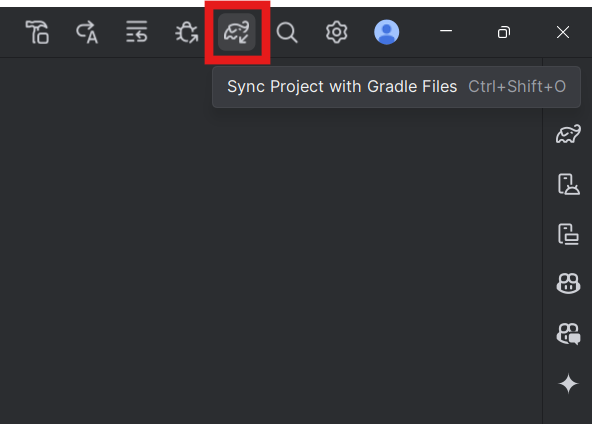 
Click the **elephant icon** to sync the project with Gradle files.

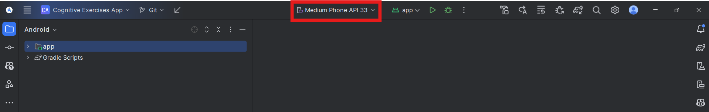 
At the top center, select the virtual device (e.g. **"Medium Phone API 33"**).

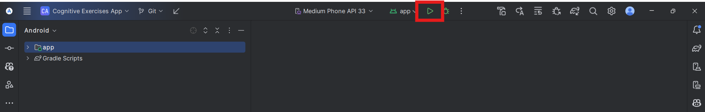 
Click the **Play** button to run the app.

### 6. Allow Permissions

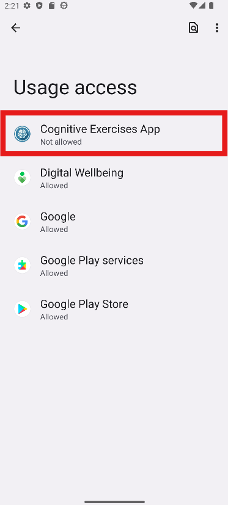 
Tap **Cognitive Exercise App** from the list.
   
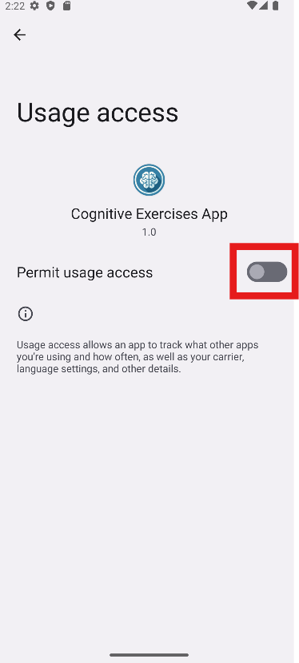 
Enable **Usage Access**.
   
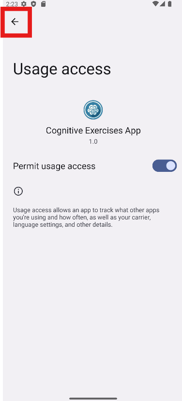 
Press the **back button twice** to return.
   
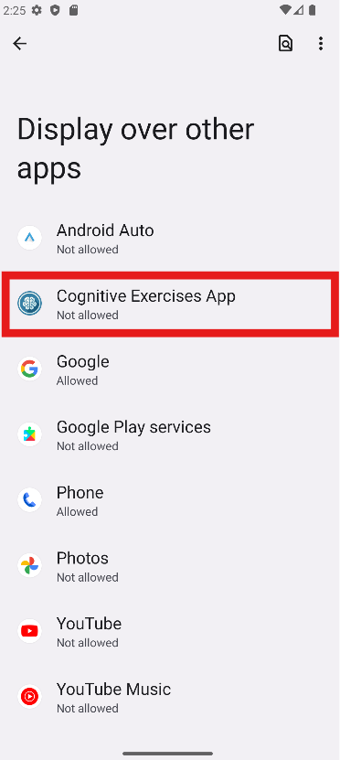 
Tap **Cognitive Exercise App** again.
   
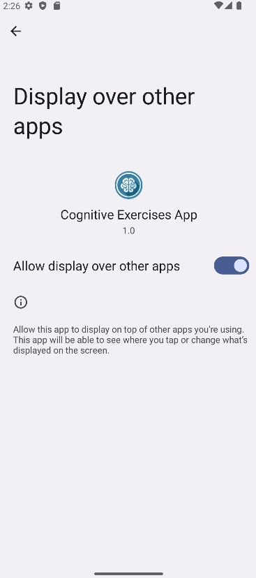 
Enable **Display over other apps**.
   
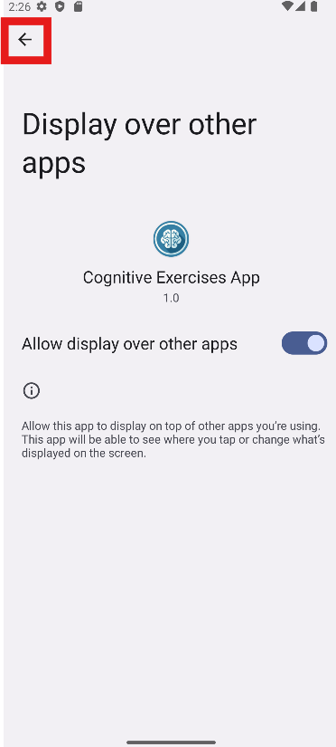 
Press **back** once to return to the app.
 
### 7. Done

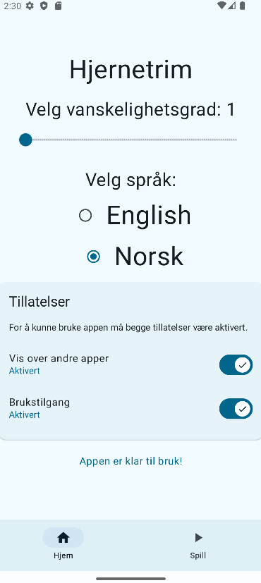 
The app is now ready to use!

---

## 🚧 Iterative Development

Cognify was built in three iterations:

- **Iteration 1**: Branch -> [1Iteration](https://github.com/GamerForFunn/Bachelor_Project_CognitiveApp/tree/1Iterasjon)
- **Iteration 2**: Branch -> [2Iteration](https://github.com/GamerForFunn/Bachelor_Project_CognitiveApp/tree/2Iteration)
- **Iteration 3**: Branch -> [Main](https://github.com/GamerForFunn/Bachelor_Project_CognitiveApp/tree/Main)

---

## 🔐 Permissions

Cognify requires the following **special Android permissions**:

- `SYSTEM_ALERT_WINDOW`: Used to display pop-ups over other apps.
- `PACKAGE_USAGE_STATS`: Used to detect app usage (e.g., Chrome).

⚠️ These are **special permissions**, not standard runtime permissions like camera or location. They must be enabled manually in Android system settings.

---

## 📚 Technologies Used

- Kotlin
- Android SDK
- Android Jetpack Components

---

## 📄 Research & Design

- [Research Paper](https://www.scitepress.org/Papers/2024/126257/126257.pdf)
- [Figma Prototype](https://www.figma.com/design/GOfwpml0BxDlsNBl9HMvI1/Prototype-4---all-exercises?node-id=0-1&p=f)

---

## 🧑‍💻 Contributors

- Bedia Feyza Yesiltoklu
- Leila Katrin Jakobsen
- Tobias Rønningen
- Bastian Stokke Opsahl
- Julian Skog Krabbe
- Petter Torst Saatvedt

---

## 🔗 Project Website

Visit the full interactive documentation and demo:  
👉 [https://sspect.github.io/Cognify/](https://sspect.github.io/Cognify/)
